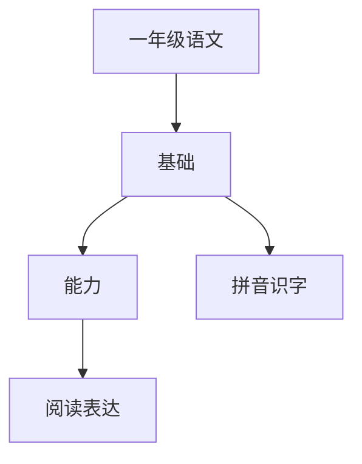

# 一年级语文知识结构

## 知识体系总览

## 知识点列表

| 序号 | 知识点 | 核心目标 |
|------|--------|---------|
| 1 | [汉语拼音](./汉语拼音) | 认读声母韵母整体认读音节，准确拼读 |
| 2 | [识字与写字](./识字与写字) | 认识常用汉字400个，会写200个，掌握基本笔画 |
| 3 | [课文朗读与背诵](./课文朗读与背诵) | 正确流利朗读课文，背诵指定篇目 |
| 4 | [口语交际](./口语交际) | 能认真听别人讲话，用普通话完整表达 |

## 学习目标

- 认读声母韵母整体认读音节，准确拼读
- 认识常用汉字400个，会写200个，掌握基本笔画
- 正确流利朗读课文，背诵指定篇目
- 能认真听别人讲话，用普通话完整表达
