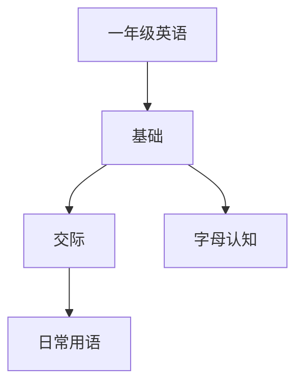

# 一年级英语知识结构

## 知识体系总览

## 知识点列表

| 序号 | 知识点 | 核心目标 |
|------|--------|---------|
| 1 | [字母认读](./字母认读) | 认读26个英文字母大小写 |
| 2 | [日常问候](./日常问候) | 掌握Hello/Goodbye/Thank you等基本用语 |
| 3 | [颜色与数字](./颜色与数字) | 用英语说出常见颜色和1-10数字 |

## 学习目标

- 认读26个英文字母大小写
- 掌握Hello/Goodbye/Thank you等基本用语
- 用英语说出常见颜色和1-10数字
