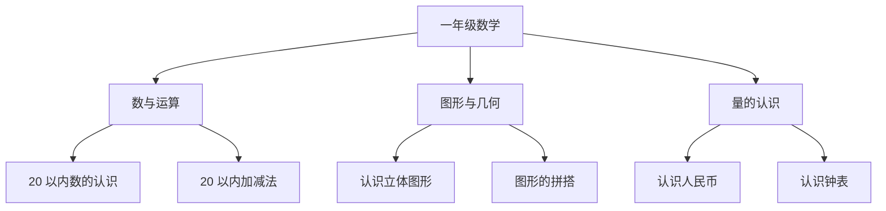

# 一年级数学知识结构

## 知识体系总览

## 知识点列表

| 序号 | 知识点 | 核心目标 |
|------|--------|---------|
| 1 | [20 以内加减法](./20以内加减法) | 掌握凑十法与破十法 |
| 2 | [认识图形](./认识图形) | 辨认常见立体图形 |
| 3 | [认识人民币](./认识人民币) | 认识元角分及简单换算 |

## 学习目标

- 熟练计算 20 以内加减法
- 能辨认长方体、正方体、圆柱和球
- 认识人民币单位，能进行简单购物计算