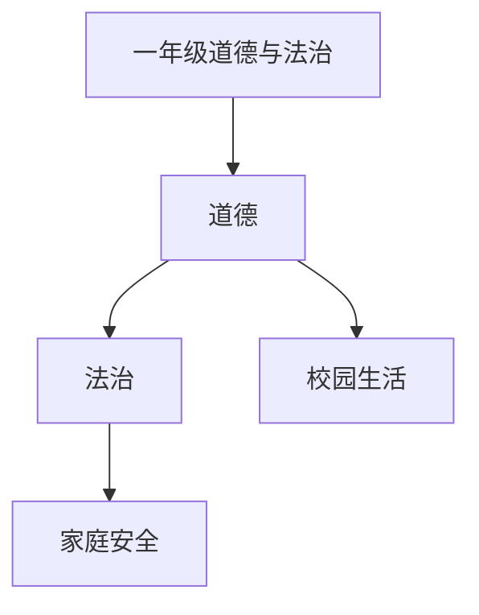

# 一年级道德与法治知识结构

## 知识体系总览

## 知识点列表

| 序号 | 知识点 | 核心目标 |
|------|--------|---------|
| 1 | [我是小学生了](./我是小学生了) | 适应校园生活，建立规则意识 |
| 2 | [校园安全](./校园安全) | 了解课间活动安全和上下学安全 |
| 3 | [我爱我家](./我爱我家) | 感受家庭温暖，学会感恩父母 |

## 学习目标

- 适应校园生活，建立规则意识
- 了解课间活动安全和上下学安全
- 感受家庭温暖，学会感恩父母
