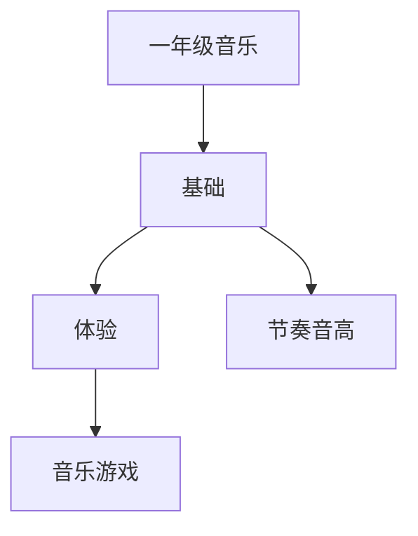

# 一年级音乐知识结构

## 知识体系总览

## 知识点列表

| 序号 | 知识点 | 核心目标 |
|------|--------|---------|
| 1 | [节奏与节拍](./节奏与节拍) | 感受二拍子三拍子，用打击乐器伴奏 |
| 2 | [音的高低](./音的高低) | 辨别音的高低，学唱简单歌曲 |

## 学习目标

- 感受二拍子三拍子，用打击乐器伴奏
- 辨别音的高低，学唱简单歌曲
