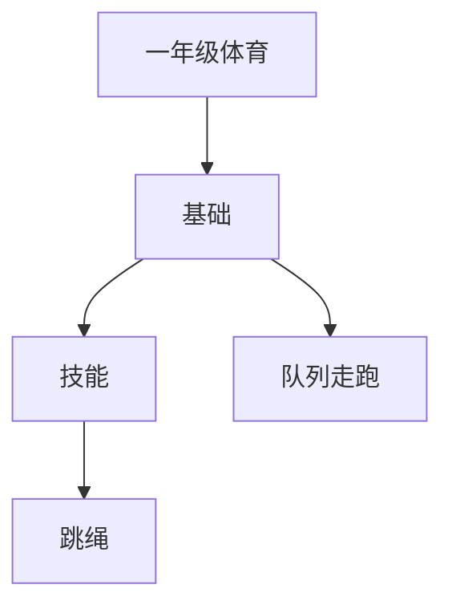

# 一年级体育知识结构

## 知识体系总览

## 知识点列表

| 序号 | 知识点 | 核心目标 |
|------|--------|---------|
| 1 | [队列与站姿](./队列与站姿) | 学会立正、稍息、看齐等基本队列 |
| 2 | [走与跑](./走与跑) | 掌握正确的走姿和跑姿 |
| 3 | [跳绳](./跳绳) | 学习并脚跳短绳，发展协调性 |

## 学习目标

- 学会立正、稍息、看齐等基本队列
- 掌握正确的走姿和跑姿
- 学习并脚跳短绳，发展协调性
