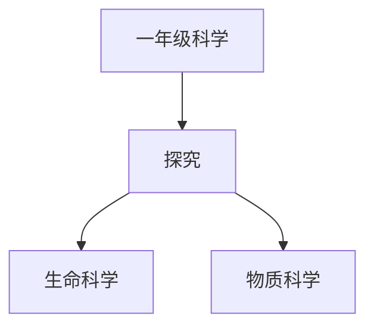

# 一年级科学知识结构

## 知识体系总览

## 知识点列表

| 序号 | 知识点 | 核心目标 |
|------|--------|---------|
| 1 | [植物的一生](./植物的一生) | 观察植物从种子到开花结果的过程 |
| 2 | [身边的材料](./身边的材料) | 认识木头、塑料、金属、纸等常见材料 |
| 3 | [水的特性](./水的特性) | 了解水的颜色气味流动性和三态 |

## 学习目标

- 观察植物从种子到开花结果的过程
- 认识木头、塑料、金属、纸等常见材料
- 了解水的颜色气味流动性和三态
