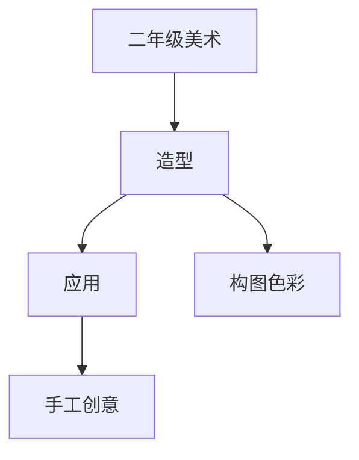

# 二年级美术知识结构

## 知识体系总览

## 知识点列表

| 序号 | 知识点 | 核心目标 |
|------|--------|---------|
| 1 | [构图入门](./构图入门) | 学习画面主次大小前后关系 |
| 2 | [色彩混合](./色彩混合) | 学习间色调配，尝试渐变涂色 |
| 3 | [创意手工](./创意手工) | 利用多种材料进行综合手工创作 |

## 学习目标

- 学习画面主次大小前后关系
- 学习间色调配，尝试渐变涂色
- 利用多种材料进行综合手工创作
