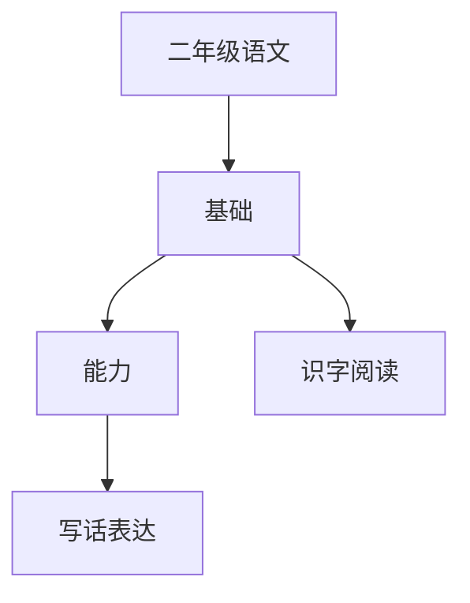

# 二年级语文知识结构

## 知识体系总览

## 知识点列表

| 序号 | 知识点 | 核心目标 |
|------|--------|---------|
| 1 | [识字与写字](./识字与写字) | 累计认字1600个，会写800个，掌握偏旁部首 |
| 2 | [查字典](./查字典) | 学会音序查字法和部首查字法 |
| 3 | [阅读与理解](./阅读与理解) | 能读懂短文内容，提取关键信息 |
| 4 | [看图写话](./看图写话) | 能根据图片写出完整通顺的几句话 |

## 学习目标

- 累计认字1600个，会写800个，掌握偏旁部首
- 学会音序查字法和部首查字法
- 能读懂短文内容，提取关键信息
- 能根据图片写出完整通顺的几句话
