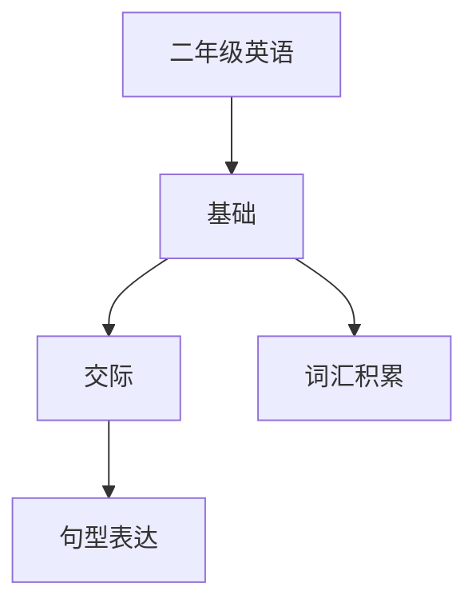

# 二年级英语知识结构

## 知识体系总览

## 知识点列表

| 序号 | 知识点 | 核心目标 |
|------|--------|---------|
| 1 | [词汇积累](./词汇积累) | 掌握动物、食物、家庭成员等主题词汇 |
| 2 | [简单句型](./简单句型) | 会用This is / I like / I can等句型 |
| 3 | [英语歌曲](./英语歌曲) | 学唱英文儿歌，培养语感 |

## 学习目标

- 掌握动物、食物、家庭成员等主题词汇
- 会用This is / I like / I can等句型
- 学唱英文儿歌，培养语感
