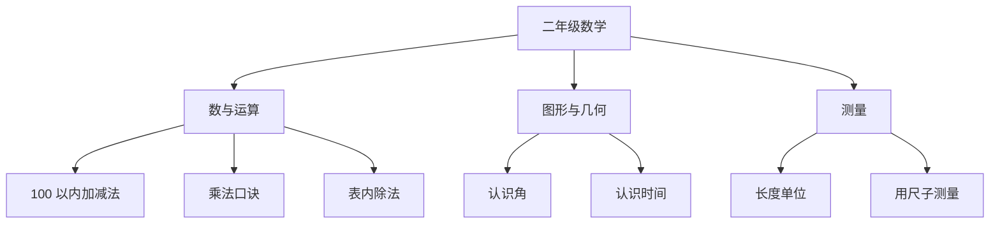

# 二年级数学知识结构

## 知识体系总览

## 知识点列表

| 序号 | 知识点 | 核心目标 |
|------|--------|---------|
| 1 | [100 以内加减法](./100以内加减法) | 掌握竖式进退位计算 |
| 2 | [乘法口诀](./乘法口诀) | 熟记 1-9 乘法口诀 |
| 3 | [长度单位](./长度单位) | 认识厘米和米，会测量 |

## 学习目标

- 熟练计算 100 以内加减法
- 熟记乘法口诀，会表内乘除法
- 认识长度单位，会估测和测量