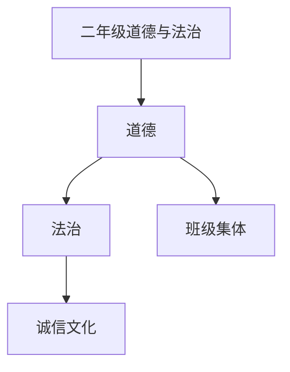

# 二年级道德与法治知识结构

## 知识体系总览

## 知识点列表

| 序号 | 知识点 | 核心目标 |
|------|--------|---------|
| 1 | [班级是我家](./班级是我家) | 培养集体荣誉感，学会为班级服务 |
| 2 | [诚实守信](./诚实守信) | 理解诚实的重要性，不说谎 |
| 3 | [传统节日](./传统节日) | 了解春节中秋端午等传统节日文化 |

## 学习目标

- 培养集体荣誉感，学会为班级服务
- 理解诚实的重要性，不说谎
- 了解春节中秋端午等传统节日文化
