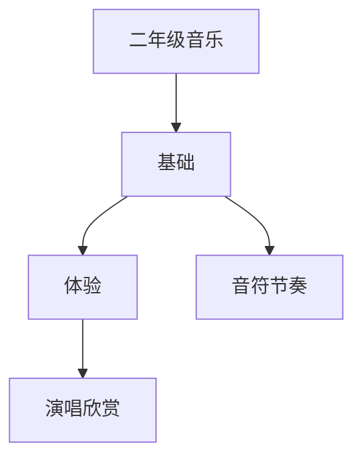

# 二年级音乐知识结构

## 知识体系总览

## 知识点列表

| 序号 | 知识点 | 核心目标 |
|------|--------|---------|
| 1 | [音符与节奏型](./音符与节奏型) | 认识四分音符八分音符，拍读简单节奏 |
| 2 | [歌曲演唱](./歌曲演唱) | 用自然的声音有表情地演唱歌曲 |

## 学习目标

- 认识四分音符八分音符，拍读简单节奏
- 用自然的声音有表情地演唱歌曲
