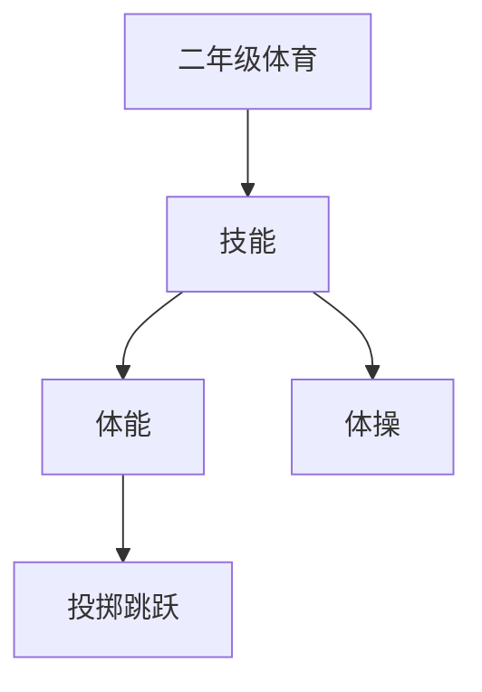

# 二年级体育知识结构

## 知识体系总览

## 知识点列表

| 序号 | 知识点 | 核心目标 |
|------|--------|---------|
| 1 | [广播体操](./广播体操) | 学习第三套广播体操基本动作 |
| 2 | [投掷与接球](./投掷与接球) | 学习垒球投掷和接球基本技术 |
| 3 | [跳跃练习](./跳跃练习) | 掌握立定跳远和单脚跳技术 |

## 学习目标

- 学习第三套广播体操基本动作
- 学习垒球投掷和接球基本技术
- 掌握立定跳远和单脚跳技术
