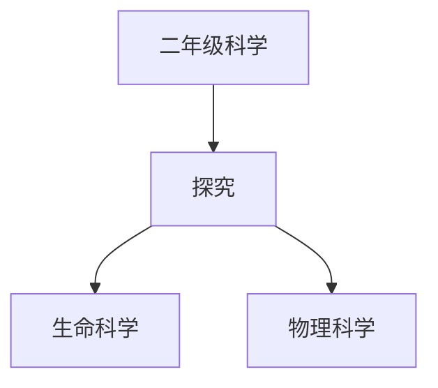

# 二年级科学知识结构

## 知识体系总览

## 知识点列表

| 序号 | 知识点 | 核心目标 |
|------|--------|---------|
| 1 | [动物世界](./动物世界) | 了解常见动物的分类 |
| 2 | [磁铁的秘密](./磁铁的秘密) | 探究磁铁的性质：同极相斥异极相吸 |
| 3 | [天气观测](./天气观测) | 观察记录天气变化，认识天气符号 |

## 学习目标

- 了解常见动物的分类
- 探究磁铁的性质：同极相斥异极相吸
- 观察记录天气变化，认识天气符号
