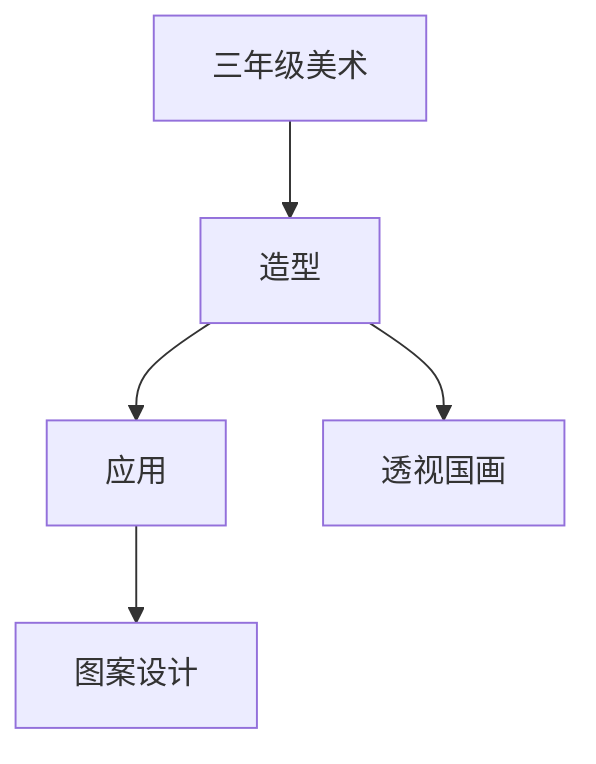

# 三年级美术知识结构

## 知识体系总览

## 知识点列表

| 序号 | 知识点 | 核心目标 |
|------|--------|---------|
| 1 | [透视与空间](./透视与空间) | 初步了解近大远小的透视原理 |
| 2 | [中国画入门](./中国画入门) | 体验毛笔和墨色的基本用法 |
| 3 | [图案设计](./图案设计) | 学习对称、重复的图案设计方法 |

## 学习目标

- 初步了解近大远小的透视原理
- 体验毛笔和墨色的基本用法
- 学习对称、重复的图案设计方法
