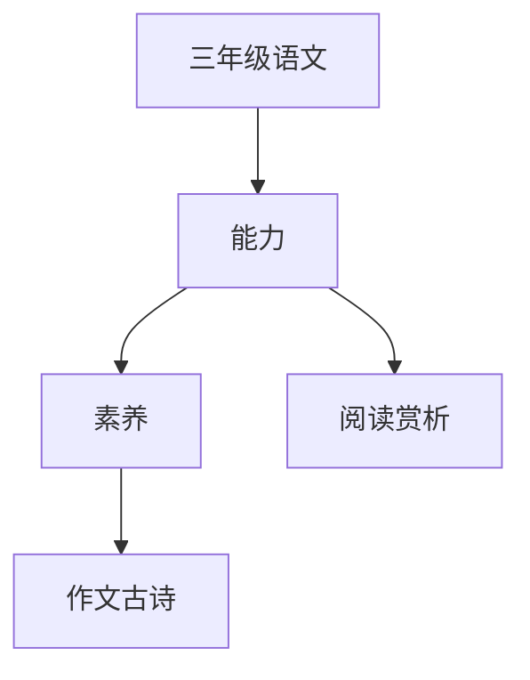

# 三年级语文知识结构

## 知识体系总览

## 知识点列表

| 序号 | 知识点 | 核心目标 |
|------|--------|---------|
| 1 | [阅读与赏析](./阅读与赏析) | 理解文章主要内容，体会思想感情 |
| 2 | [作文起步](./作文起步) | 学习写日记、书信、观察作文 |
| 3 | [古诗文积累](./古诗文积累) | 背诵古诗词20首，理解大意 |
| 4 | [修辞手法](./修辞手法) | 初步认识比喻、拟人等修辞手法 |

## 学习目标

- 理解文章主要内容，体会思想感情
- 学习写日记、书信、观察作文
- 背诵古诗词20首，理解大意
- 初步认识比喻、拟人等修辞手法
