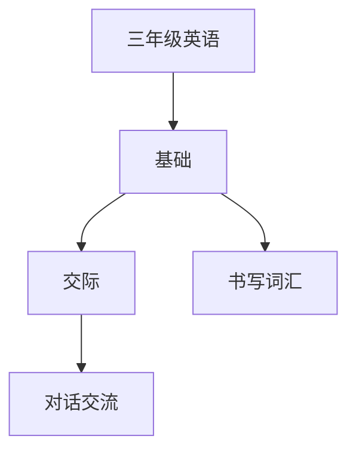

# 三年级英语知识结构

## 知识体系总览

## 知识点列表

| 序号 | 知识点 | 核心目标 |
|------|--------|---------|
| 1 | [字母书写](./字母书写) | 规范书写26个字母大小写 |
| 2 | [词汇扩展](./词汇扩展) | 掌握学校、身体、衣物等主题词汇 |
| 3 | [对话交流](./对话交流) | 会进行简单的日常对话 |

## 学习目标

- 规范书写26个字母大小写
- 掌握学校、身体、衣物等主题词汇
- 会进行简单的日常对话
