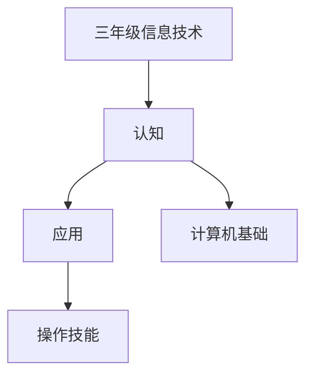

# 三年级信息技术知识结构

## 知识体系总览

## 知识点列表

| 序号 | 知识点 | 核心目标 |
|------|--------|---------|
| 1 | [认识计算机](./认识计算机) | 了解计算机的组成，学会开关机 |
| 2 | [键盘与鼠标](./键盘与鼠标) | 掌握正确的键盘指法和鼠标操作 |
| 3 | [画图软件](./画图软件) | 使用画图工具进行简单绘画创作 |

## 学习目标

- 了解计算机的组成，学会开关机
- 掌握正确的键盘指法和鼠标操作
- 使用画图工具进行简单绘画创作
