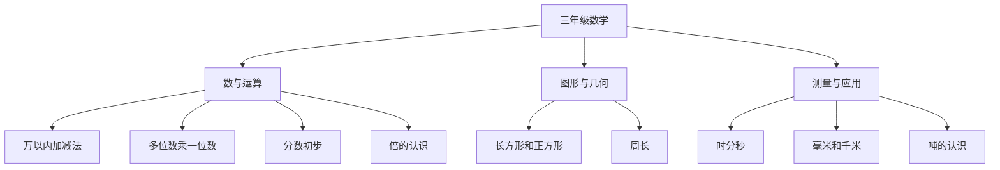

# 三年级数学知识结构

## 知识体系总览

## 知识点列表

| 序号 | 知识点 | 核心目标 |
|------|--------|---------|
| 1 | [万以内加减法](./万以内加减法) | 掌握万以内数的加减法 |
| 2 | [多位数乘一位数](./多位数乘一位数) | 掌握竖式乘法 |
| 3 | [分数初步](./分数初步) | 认识分数，理解几分之一 |

## 学习目标

- 熟练计算万以内加减法
- 掌握多位数乘一位数
- 初步认识分数