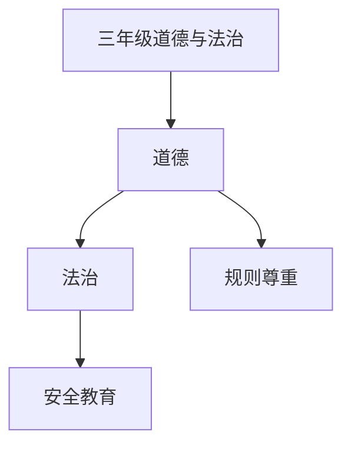

# 三年级道德与法治知识结构

## 知识体系总览

## 知识点列表

| 序号 | 知识点 | 核心目标 |
|------|--------|---------|
| 1 | [规则与秩序](./规则与秩序) | 理解公共场所的规则，自觉遵守 |
| 2 | [学会尊重](./学会尊重) | 尊重他人的劳动和不同意见 |
| 3 | [安全教育](./安全教育) | 交通安全、消防安全、防溺水知识 |

## 学习目标

- 理解公共场所的规则，自觉遵守
- 尊重他人的劳动和不同意见
- 交通安全、消防安全、防溺水知识
