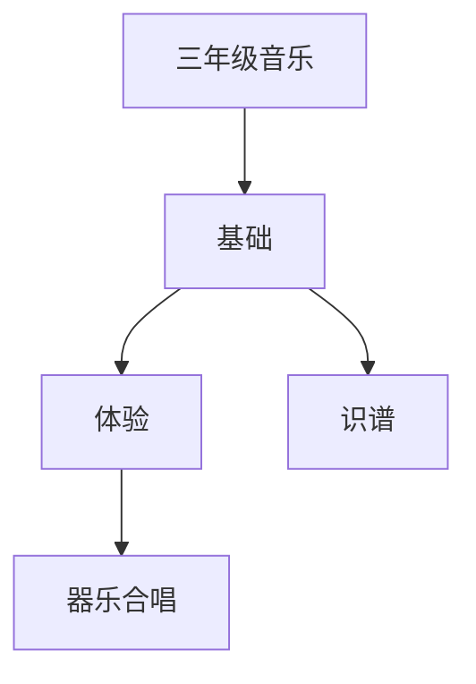

# 三年级音乐知识结构

## 知识体系总览

## 知识点列表

| 序号 | 知识点 | 核心目标 |
|------|--------|---------|
| 1 | [识谱入门](./识谱入门) | 认识简谱，视唱简单旋律 |
| 2 | [竖笛/口风琴](./竖笛-口风琴) | 学习课堂乐器的基本演奏方法 |
| 3 | [合唱初步](./合唱初步) | 体验二声部合唱，培养合作意识 |

## 学习目标

- 认识简谱，视唱简单旋律
- 学习课堂乐器的基本演奏方法
- 体验二声部合唱，培养合作意识
