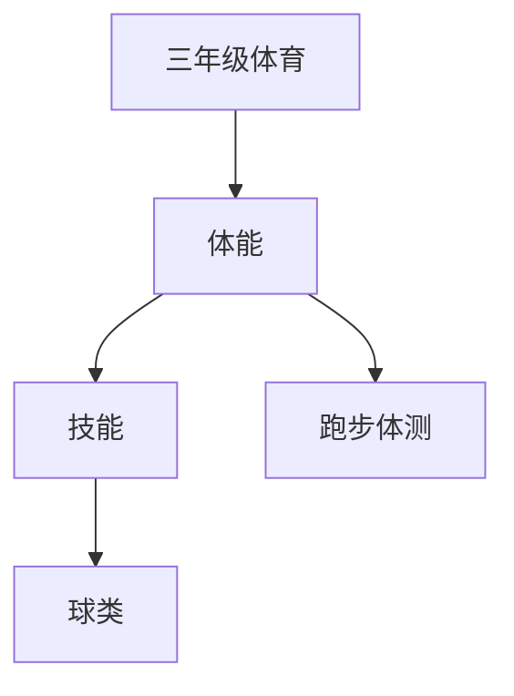

# 三年级体育知识结构

## 知识体系总览

## 知识点列表

| 序号 | 知识点 | 核心目标 |
|------|--------|---------|
| 1 | [50米跑](./50米跑) | 掌握起跑和途中跑技术 |
| 2 | [仰卧起坐](./仰卧起坐) | 掌握正确的仰卧起坐技术 |
| 3 | [球类入门](./球类入门) | 学习篮球运球、足球传球等基本技术 |

## 学习目标

- 掌握起跑和途中跑技术
- 掌握正确的仰卧起坐技术
- 学习篮球运球、足球传球等基本技术
