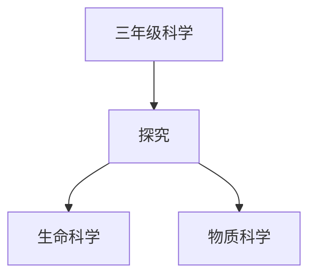

# 三年级科学知识结构

## 知识体系总览

## 知识点列表

| 序号 | 知识点 | 核心目标 |
|------|--------|---------|
| 1 | [植物的身体](./植物的身体) | 认识根茎叶花果实种子及其功能 |
| 2 | [空气与风](./空气与风) | 了解空气的性质，认识风的成因 |
| 3 | [固液气三态](./固液气三态) | 通过实验理解物质的三种状态及其转化 |

## 学习目标

- 认识根茎叶花果实种子及其功能
- 了解空气的性质，认识风的成因
- 通过实验理解物质的三种状态及其转化
