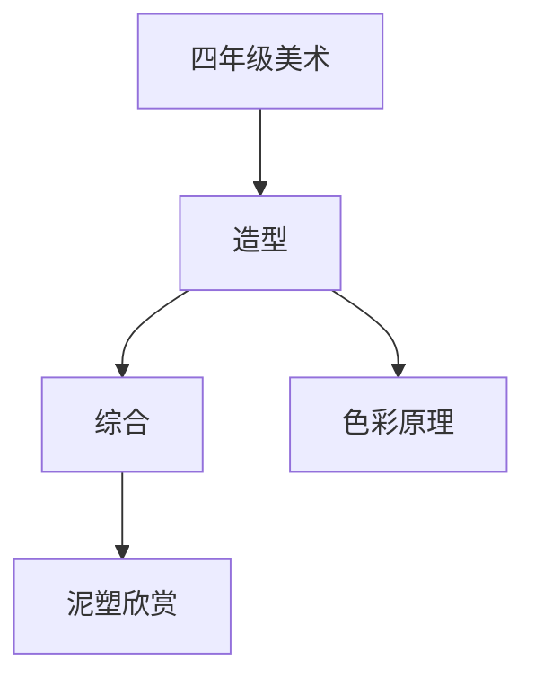

# 四年级美术知识结构

## 知识体系总览

## 知识点列表

| 序号 | 知识点 | 核心目标 |
|------|--------|---------|
| 1 | [色彩原理](./色彩原理) | 了解色彩三要素：色相、明度、纯度 |
| 2 | [泥塑造型](./泥塑造型) | 学习泥塑的基本技法，创作立体作品 |
| 3 | [欣赏与评述](./欣赏与评述) | 学习用美术语言描述和评价作品 |

## 学习目标

- 了解色彩三要素：色相、明度、纯度
- 学习泥塑的基本技法，创作立体作品
- 学习用美术语言描述和评价作品
