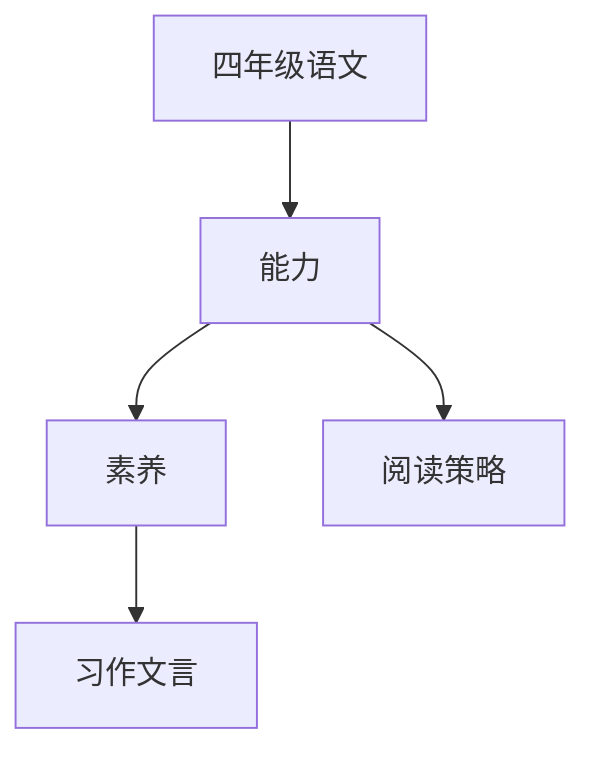

# 四年级语文知识结构

## 知识体系总览

## 知识点列表

| 序号 | 知识点 | 核心目标 |
|------|--------|---------|
| 1 | [阅读策略](./阅读策略) | 学会预测、提问、概括等阅读策略 |
| 2 | [习作训练](./习作训练) | 学习写人记事写景状物类作文 |
| 3 | [文言文入门](./文言文入门) | 学习简短文言文，理解基本字词 |

## 学习目标

- 学会预测、提问、概括等阅读策略
- 学习写人记事写景状物类作文
- 学习简短文言文，理解基本字词
