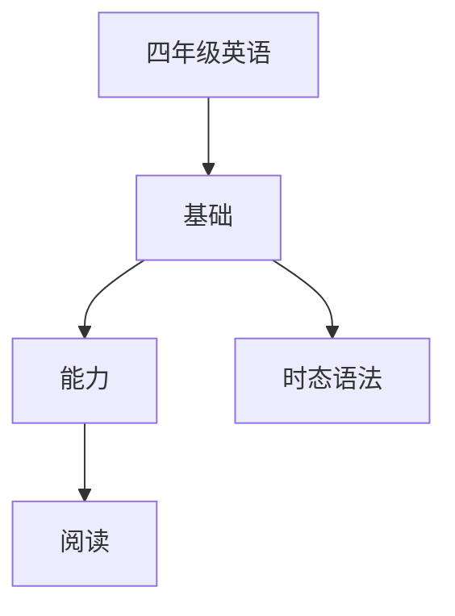

# 四年级英语知识结构

## 知识体系总览

## 知识点列表

| 序号 | 知识点 | 核心目标 |
|------|--------|---------|
| 1 | [现在进行时](./现在进行时) | 理解并运用现在进行时描述正在发生的动作 |
| 2 | [句型拓展](./句型拓展) | 掌握There be / What time等句型 |
| 3 | [短文阅读](./短文阅读) | 阅读50词左右的短文，理解大意 |

## 学习目标

- 理解并运用现在进行时描述正在发生的动作
- 掌握There be / What time等句型
- 阅读50词左右的短文，理解大意
