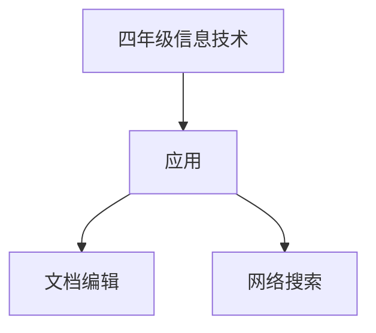

# 四年级信息技术知识结构

## 知识体系总览

## 知识点列表

| 序号 | 知识点 | 核心目标 |
|------|--------|---------|
| 1 | [文档编辑](./文档编辑) | 使用Word/WPS进行文字录入和排版 |
| 2 | [网络搜索](./网络搜索) | 学会使用搜索引擎查找资料 |
| 3 | [文件管理](./文件管理) | 掌握文件和文件夹的创建、复制、移动 |

## 学习目标

- 使用Word/WPS进行文字录入和排版
- 学会使用搜索引擎查找资料
- 掌握文件和文件夹的创建、复制、移动
