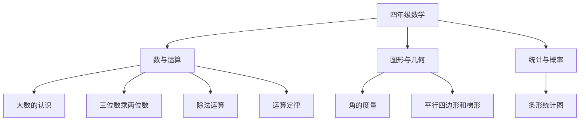

# 四年级数学知识结构

## 知识体系总览

## 知识点列表

| 序号 | 知识点 | 核心目标 |
|------|--------|---------|
| 1 | [大数的认识](./大数的认识) | 认识亿以内数，会读写 |
| 2 | [三位数乘两位数](./三位数乘两位数) | 掌握复杂的乘法笔算 |
| 3 | [除法运算](./除法运算) | 掌握除数是两位数的除法 |

## 学习目标

- 认识亿以内的数，掌握数位顺序
- 熟练进行三位数乘两位数和除数是两位数的除法
- 理解加法、乘法运算定律