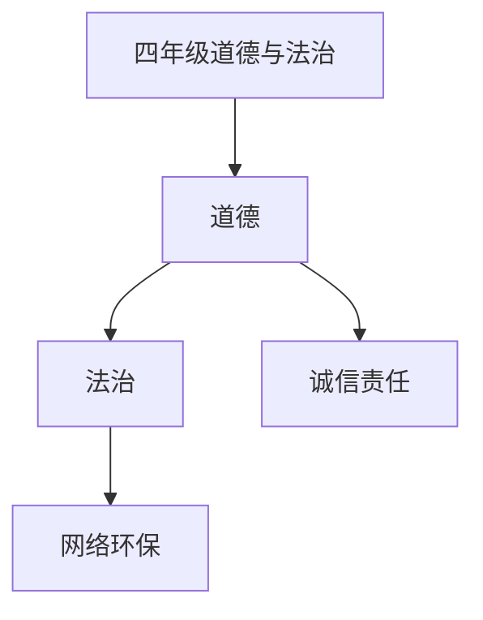

# 四年级道德与法治知识结构

## 知识体系总览

## 知识点列表

| 序号 | 知识点 | 核心目标 |
|------|--------|---------|
| 1 | [诚信与责任](./诚信与责任) | 理解诚信的价值，学会对自己的行为负责 |
| 2 | [网络文明](./网络文明) | 了解网络安全和文明上网的基本规范 |
| 3 | [环境保护](./环境保护) | 了解环境污染问题，树立环保意识 |

## 学习目标

- 理解诚信的价值，学会对自己的行为负责
- 了解网络安全和文明上网的基本规范
- 了解环境污染问题，树立环保意识
