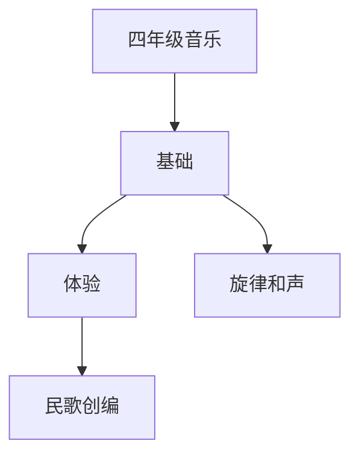

# 四年级音乐知识结构

## 知识体系总览

## 知识点列表

| 序号 | 知识点 | 核心目标 |
|------|--------|---------|
| 1 | [旋律与和声](./旋律与和声) | 感受旋律进行方向，体验和声效果 |
| 2 | [中外民歌](./中外民歌) | 学唱中国民歌和简单的外国民歌 |

## 学习目标

- 感受旋律进行方向，体验和声效果
- 学唱中国民歌和简单的外国民歌
