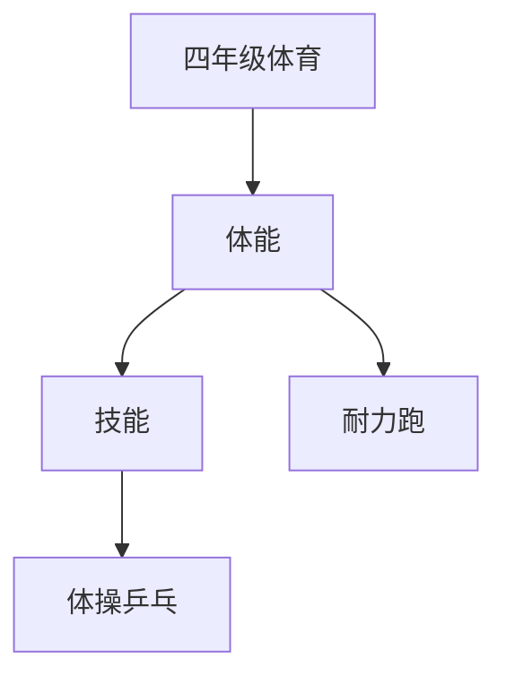

# 四年级体育知识结构

## 知识体系总览

## 知识点列表

| 序号 | 知识点 | 核心目标 |
|------|--------|---------|
| 1 | [400米耐力跑](./400米耐力跑) | 掌握耐久跑的呼吸节奏和体力分配 |
| 2 | [体操技巧](./体操技巧) | 学习前滚翻、后滚翻等垫上运动 |
| 3 | [乒乓球入门](./乒乓球入门) | 学习握拍和正手攻球基本技术 |

## 学习目标

- 掌握耐久跑的呼吸节奏和体力分配
- 学习前滚翻、后滚翻等垫上运动
- 学习握拍和正手攻球基本技术
