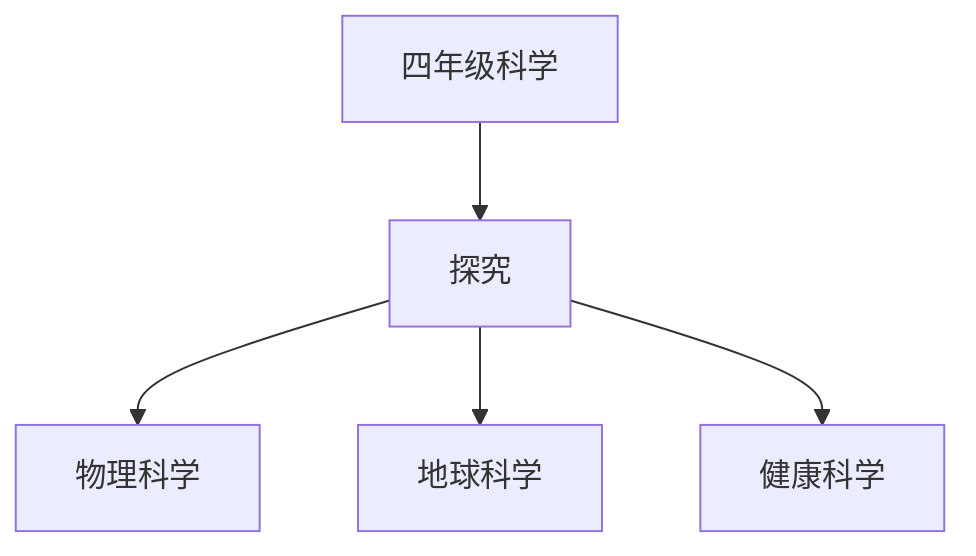

# 四年级科学知识结构

## 知识体系总览

## 知识点列表

| 序号 | 知识点 | 核心目标 |
|------|--------|---------|
| 1 | [电路探秘](./电路探秘) | 了解简单电路，认识导体和绝缘体 |
| 2 | [岩石与矿物](./岩石与矿物) | 认识常见岩石和矿物，了解其特征 |
| 3 | [食物与营养](./食物与营养) | 了解食物的营养成分和健康饮食搭配 |

## 学习目标

- 了解简单电路，认识导体和绝缘体
- 认识常见岩石和矿物，了解其特征
- 了解食物的营养成分和健康饮食搭配
