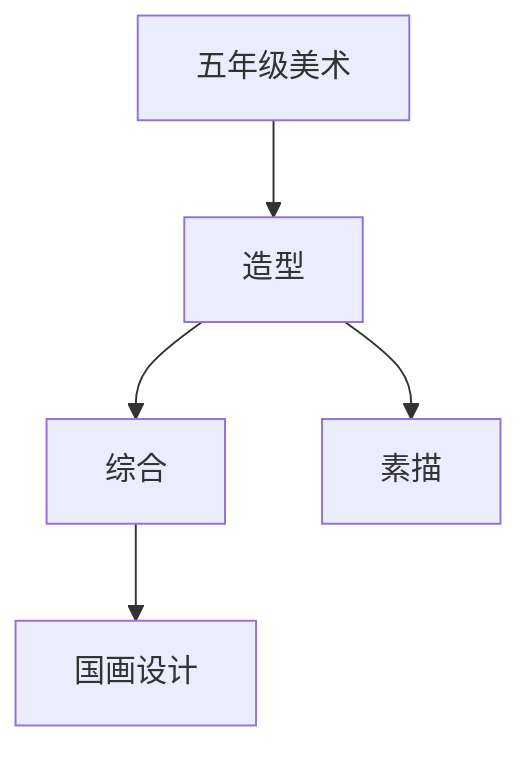

# 五年级美术知识结构

## 知识体系总览

## 知识点列表

| 序号 | 知识点 | 核心目标 |
|------|--------|---------|
| 1 | [素描基础](./素描基础) | 学习明暗调子和体积感的表现 |
| 2 | [国画技法](./国画技法) | 学习写意花鸟画的基本技法 |
| 3 | [设计与应用](./设计与应用) | 进行海报、贺卡等实用美术设计 |

## 学习目标

- 学习明暗调子和体积感的表现
- 学习写意花鸟画的基本技法
- 进行海报、贺卡等实用美术设计
