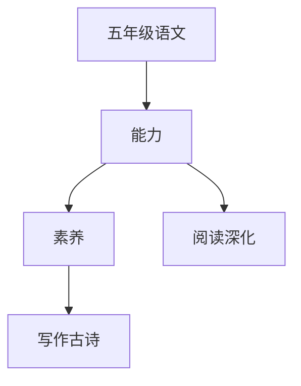

# 五年级语文知识结构

## 知识体系总览

## 知识点列表

| 序号 | 知识点 | 核心目标 |
|------|--------|---------|
| 1 | [阅读深化](./阅读深化) | 分析文章结构、写作手法和表达效果 |
| 2 | [说明文写作](./说明文写作) | 学习写简单的说明文，使用说明方法 |
| 3 | [古诗文鉴赏](./古诗文鉴赏) | 理解古诗的意境和表达技巧 |
| 4 | [名著导读](./名著导读) | 阅读《西游记》等经典名著的少儿版 |

## 学习目标

- 分析文章结构、写作手法和表达效果
- 学习写简单的说明文，使用说明方法
- 理解古诗的意境和表达技巧
- 阅读《西游记》等经典名著的少儿版
