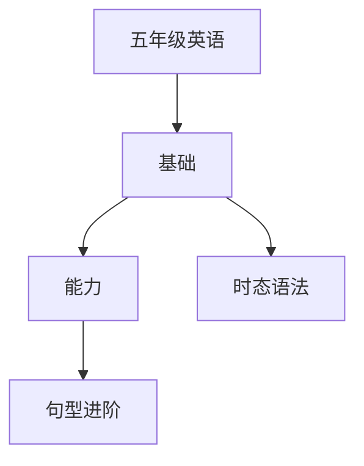

# 五年级英语知识结构

## 知识体系总览

## 知识点列表

| 序号 | 知识点 | 核心目标 |
|------|--------|---------|
| 1 | [一般现在时](./一般现在时) | 掌握一般现在时的结构和用法 |
| 2 | [一般过去时](./一般过去时) | 理解一般过去时，掌握规则动词过去式 |
| 3 | [句型进阶](./句型进阶) | 掌握Wh-疑问句和比较级句型 |

## 学习目标

- 掌握一般现在时的结构和用法
- 理解一般过去时，掌握规则动词过去式
- 掌握Wh-疑问句和比较级句型
