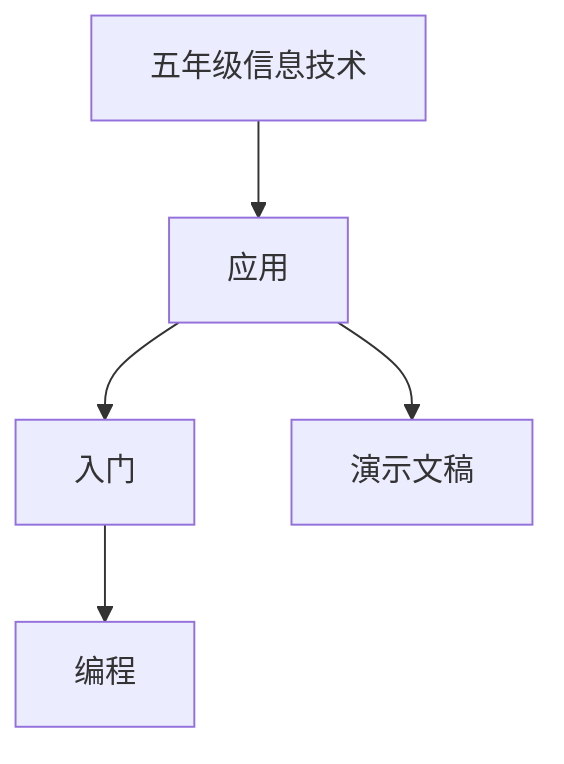

# 五年级信息技术知识结构

## 知识体系总览

## 知识点列表

| 序号 | 知识点 | 核心目标 |
|------|--------|---------|
| 1 | [演示文稿](./演示文稿) | 使用PPT制作包含文字图片的演示文稿 |
| 2 | [编程启蒙](./编程启蒙) | 使用Scratch进行图形化编程入门 |
| 3 | [信息安全](./信息安全) | 了解个人信息保护和网络安全常识 |

## 学习目标

- 使用PPT制作包含文字图片的演示文稿
- 使用Scratch进行图形化编程入门
- 了解个人信息保护和网络安全常识
