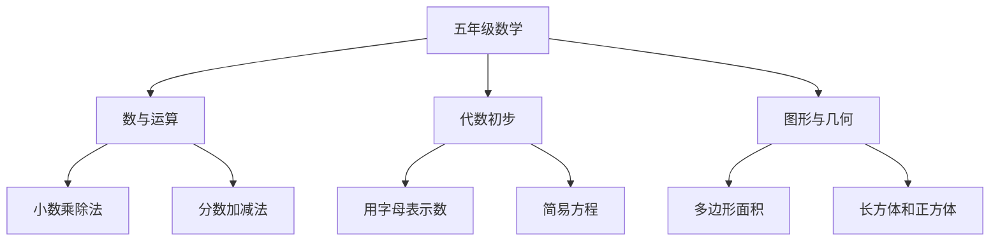

# 五年级数学知识结构

## 知识体系总览

## 知识点列表

| 序号 | 知识点 | 核心目标 |
|------|--------|---------|
| 1 | [小数乘除法](./小数乘除法) | 掌握小数乘除计算 |
| 2 | [分数加减法](./分数加减法) | 掌握异分母分数加减 |
| 3 | [简易方程](./简易方程) | 会用字母表示数，解方程 |

## 学习目标

- 熟练进行小数乘除法和分数加减法
- 初步建立代数思维
- 理解多边形面积公式