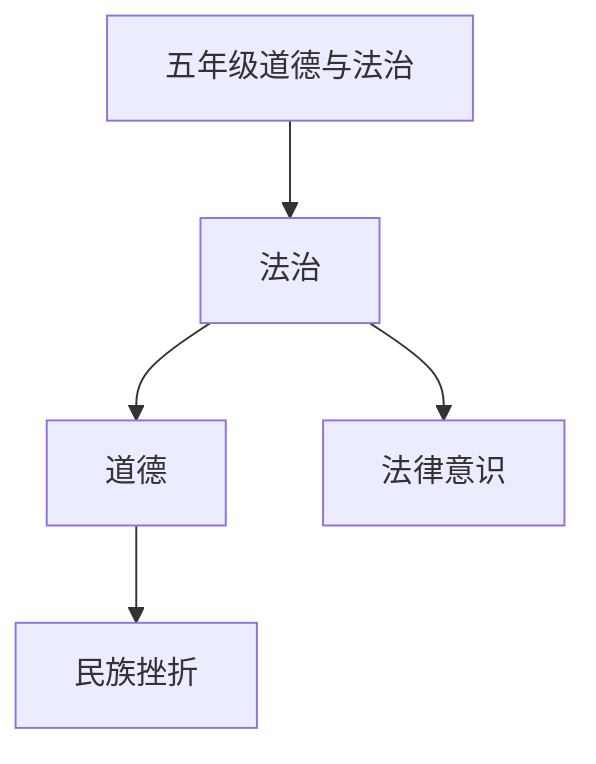

# 五年级道德与法治知识结构

## 知识体系总览

## 知识点列表

| 序号 | 知识点 | 核心目标 |
|------|--------|---------|
| 1 | [法律意识](./法律意识) | 初步了解宪法，知道公民的基本权利和义务 |
| 2 | [民族团结](./民族团结) | 了解我国56个民族，尊重多元文化 |
| 3 | [挫折教育](./挫折教育) | 学会正确面对挫折，培养抗挫折能力 |

## 学习目标

- 初步了解宪法，知道公民的基本权利和义务
- 了解我国56个民族，尊重多元文化
- 学会正确面对挫折，培养抗挫折能力
