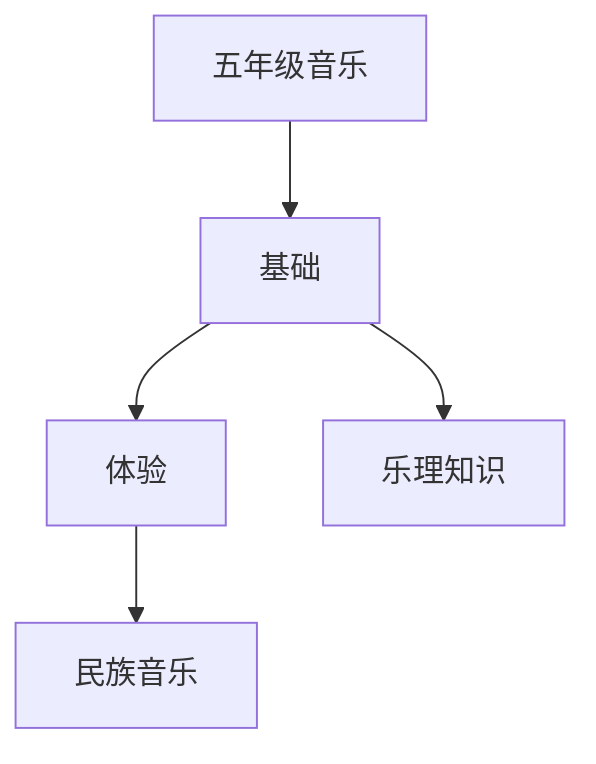

# 五年级音乐知识结构

## 知识体系总览

## 知识点列表

| 序号 | 知识点 | 核心目标 |
|------|--------|---------|
| 1 | [乐理知识](./乐理知识) | 认识五线谱，了解常用音乐术语 |
| 2 | [民族音乐](./民族音乐) | 了解中国民族乐器分类和代表性曲目 |
| 3 | [音乐表现](./音乐表现) | 有感情地演唱歌曲，进行简单的音乐表演 |

## 学习目标

- 认识五线谱，了解常用音乐术语
- 了解中国民族乐器分类和代表性曲目
- 有感情地演唱歌曲，进行简单的音乐表演
