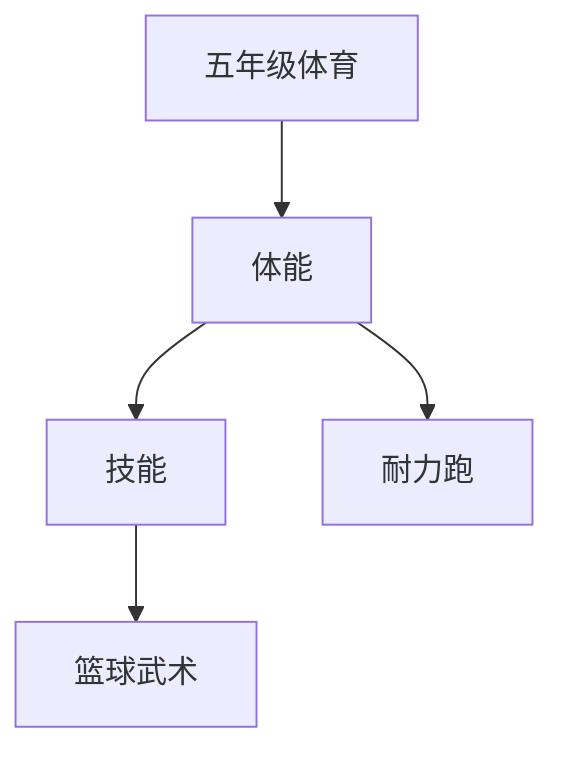

# 五年级体育知识结构

## 知识体系总览

## 知识点列表

| 序号 | 知识点 | 核心目标 |
|------|--------|---------|
| 1 | [50米x8往返跑](./50米x8往返跑) | 掌握折返跑技术和耐力分配 |
| 2 | [篮球基础](./篮球基础) | 学习运球、传球、投篮基本技术 |
| 3 | [武术入门](./武术入门) | 学习五步拳或少年拳基本套路 |

## 学习目标

- 掌握折返跑技术和耐力分配
- 学习运球、传球、投篮基本技术
- 学习五步拳或少年拳基本套路
