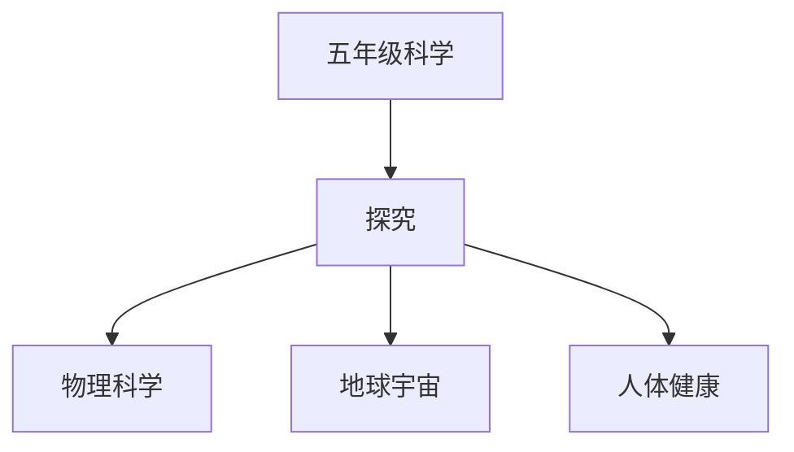

# 五年级科学知识结构

## 知识体系总览

## 知识点列表

| 序号 | 知识点 | 核心目标 |
|------|--------|---------|
| 1 | [光与色彩](./光与色彩) | 了解光的直线传播、反射和折射 |
| 2 | [地球与宇宙](./地球与宇宙) | 了解地球的自转公转、昼夜交替和四季 |
| 3 | [人体与健康](./人体与健康) | 了解人体主要器官及其功能 |

## 学习目标

- 了解光的直线传播、反射和折射
- 了解地球的自转公转、昼夜交替和四季
- 了解人体主要器官及其功能
