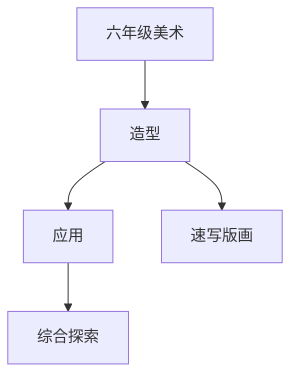

# 六年级美术知识结构

## 知识体系总览

## 知识点列表

| 序号 | 知识点 | 核心目标 |
|------|--------|---------|
| 1 | [人物速写](./人物速写) | 学习人物动态速写的基本方法 |
| 2 | [版画体验](./版画体验) | 学习纸版画或吹塑纸版画的制作 |
| 3 | [综合探索](./综合探索) | 结合多种材料和技法进行主题创作 |

## 学习目标

- 学习人物动态速写的基本方法
- 学习纸版画或吹塑纸版画的制作
- 结合多种材料和技法进行主题创作
