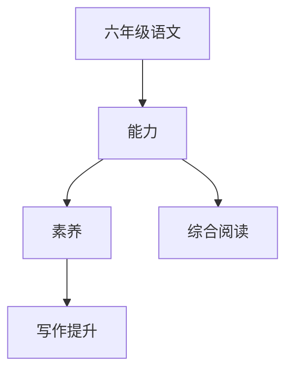

# 六年级语文知识结构

## 知识体系总览

## 知识点列表

| 序号 | 知识点 | 核心目标 |
|------|--------|---------|
| 1 | [综合阅读](./综合阅读) | 阅读叙事、说明、议论等多种文体 |
| 2 | [写作提升](./写作提升) | 学习写读后感、演讲稿、调查报告 |
| 3 | [文言文阅读](./文言文阅读) | 阅读简短的文言文，掌握常见文言词汇 |

## 学习目标

- 阅读叙事、说明、议论等多种文体
- 学习写读后感、演讲稿、调查报告
- 阅读简短的文言文，掌握常见文言词汇
