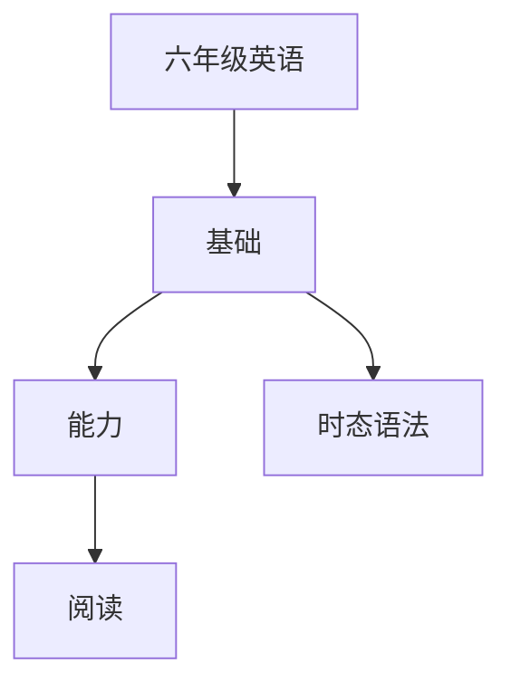

# 六年级英语知识结构

## 知识体系总览

## 知识点列表

| 序号 | 知识点 | 核心目标 |
|------|--------|---------|
| 1 | [一般将来时](./一般将来时) | 掌握一般将来时will和be going to的用法 |
| 2 | [比较级与最高级](./比较级与最高级) | 掌握形容词和副词的比较级最高级 |
| 3 | [阅读理解](./阅读理解) | 阅读80词左右的短文，回答细节问题 |

## 学习目标

- 掌握一般将来时will和be going to的用法
- 掌握形容词和副词的比较级最高级
- 阅读80词左右的短文，回答细节问题
