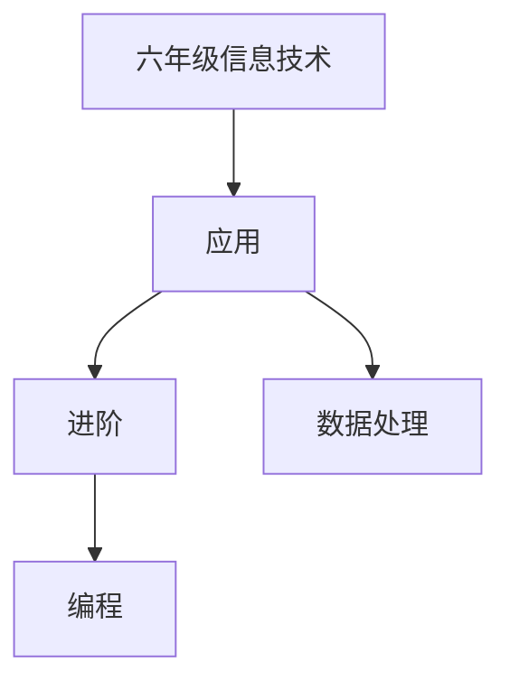

# 六年级信息技术知识结构

## 知识体系总览

## 知识点列表

| 序号 | 知识点 | 核心目标 |
|------|--------|---------|
| 1 | [数据处理](./数据处理) | 使用Excel进行简单数据录入和图表制作 |
| 2 | [Scratch编程](./Scratch编程) | 制作包含变量和条件判断的交互小项目 |
| 3 | [数字作品制作](./数字作品制作) | 综合运用多种工具制作数字作品 |

## 学习目标

- 使用Excel进行简单数据录入和图表制作
- 制作包含变量和条件判断的交互小项目
- 综合运用多种工具制作数字作品
