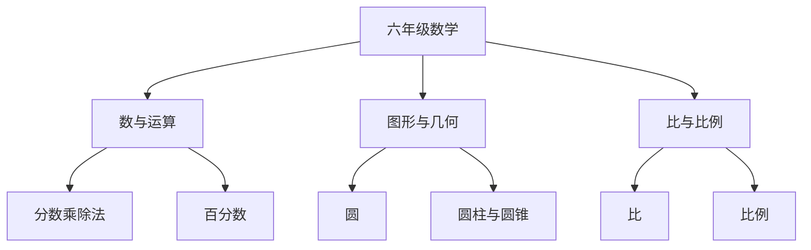

# 六年级数学知识结构

## 知识体系总览

## 知识点列表

| 序号 | 知识点 | 核心目标 |
|------|--------|---------|
| 1 | [分数乘除法](./分数乘除法) | 掌握分数乘除法及应用 |
| 2 | [百分数](./百分数) | 理解百分数意义，解决实际问题 |
| 3 | [圆柱与圆锥](./圆柱与圆锥) | 计算表面积和体积 |

## 学习目标

- 熟练进行分数乘除法运算
- 掌握百分数、比和比例的应用
- 认识圆、圆柱和圆锥并计算相关量
- 为初中数学做好衔接准备