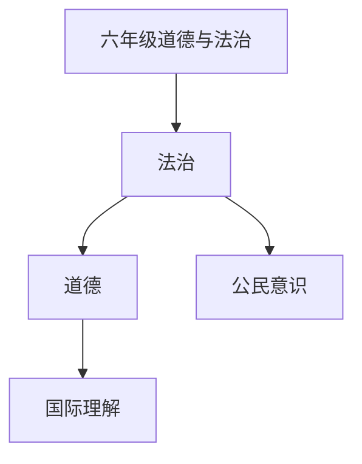

# 六年级道德与法治知识结构

## 知识体系总览

## 知识点列表

| 序号 | 知识点 | 核心目标 |
|------|--------|---------|
| 1 | [公民意识](./公民意识) | 了解公民的权利和义务，培养社会责任感 |
| 2 | [国际理解](./国际理解) | 了解世界主要国家和文化，培养国际视野 |
| 3 | [青春前期](./青春前期) | 了解青春期生理心理变化，做好心理准备 |

## 学习目标

- 了解公民的权利和义务，培养社会责任感
- 了解世界主要国家和文化，培养国际视野
- 了解青春期生理心理变化，做好心理准备
