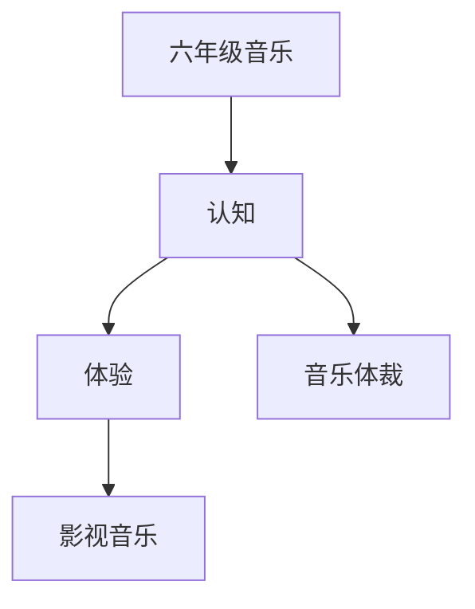

# 六年级音乐知识结构

## 知识体系总览

## 知识点列表

| 序号 | 知识点 | 核心目标 |
|------|--------|---------|
| 1 | [音乐体裁](./音乐体裁) | 了解进行曲、舞曲、交响童话等体裁 |
| 2 | [影视音乐](./影视音乐) | 欣赏经典影视音乐，感受音乐与画面的配合 |

## 学习目标

- 了解进行曲、舞曲、交响童话等体裁
- 欣赏经典影视音乐，感受音乐与画面的配合
