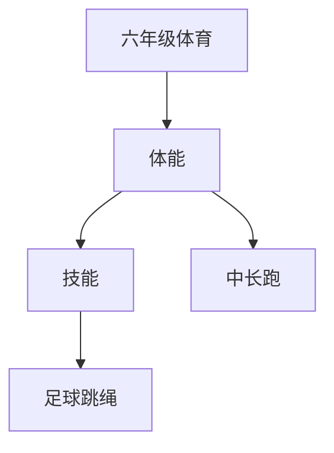

# 六年级体育知识结构

## 知识体系总览

## 知识点列表

| 序号 | 知识点 | 核心目标 |
|------|--------|---------|
| 1 | [400米跑](./400米跑) | 掌握中长跑技术和体力分配策略 |
| 2 | [足球基础](./足球基础) | 学习带球、传球、射门基本技术 |
| 3 | [跳绳进阶](./跳绳进阶) | 学习双摇跳、编花跳等花样跳绳 |

## 学习目标

- 掌握中长跑技术和体力分配策略
- 学习带球、传球、射门基本技术
- 学习双摇跳、编花跳等花样跳绳
